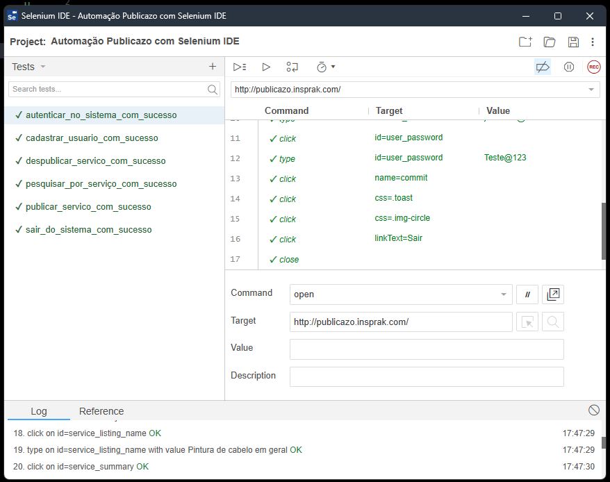

# O Projeto 📚

Projeto automação de testes da aplicação web Publicazo utilizando o Selenium IDE. Abaixo gif exibindo os testes do projeto:

# Casos de teste 📃

Os casos de teste estão dentro da pasta feature.

# Como executar o projeto 📌

**Passo 1:** nstalar extenção Selenium IDE 
Para executar o projeto é necessário ter a extenção do **Selenium IDE** instalada no navegador. Link para download pelo <a href="https://chrome.google.com/webstore/detail/selenium-ide/mooikfkahbdckldjjndioackbalphokd?hl=pt-BR">Chrome<a/>.

**Passo 2:** executar os testes do projeto 
Para executar os testes do projeto basta clicar na extenção do Selenium instalada, selecionar a opção "Open an existing project", abrir o arquivo `.side` e clicar em "Run all tests" conforme gif abaixo:

# Recursos do Selenium IDE 💡
Existem vários recursos fornecidos no IDE:

* **Controle de Velocidade:** ajuda a controlar a velocidade dos casos de teste.
* **Run All:** permite a execução de todos os testes do projeto.
* **Executar:** executa o teste selecionado.
* **Pausar/Retomar:** pausa e retoma um caso de teste.
* **Etapa:** exibe cada comando específico no script de teste.
* **Rollup:** agrupa todos os Comandos Selenese e fazê-los executar como uma única operação.

# Comandos do Selenium ✨
Os comandos são categorizados em três tipos:

* **Ações:** ajuda a manipular ou alterar o estado dos aplicativos (por exemplo, clicar em algum link ou selecionar uma opção de uma página).
* **Accessors:** habilita a verificação e armazenamento do estado do aplicativo (por exemplo, considere o comando "storeTextPresent" – se o texto for encontrado na página, ele armazena true, senão, armazena false).
* **Assertions:** comparara os resultados esperados e reais. Eles agem como checkpoints e, se ambos os valores forem iguais, somente então o caso de teste passa. Assim, Assertions ajudam a verificar se o estado do aplicativo após a execução do caso de teste está de acordo com o estado desejado (por exemplo, VerifyText, waitForPageToLoad). As asserções têm três modos:
    * Afirmar;
    * Verificar;
    * Esperar por.

# Limitações do Selenium IDE: ⚖️

* Não é adequado para testar dados extensos.
* As conexões com o banco de dados não podem ser testadas.
* Não é possível lidar com a parte dinâmica de aplicativos baseados na Web.
* Não suporta capturas de tela em falhas de teste.